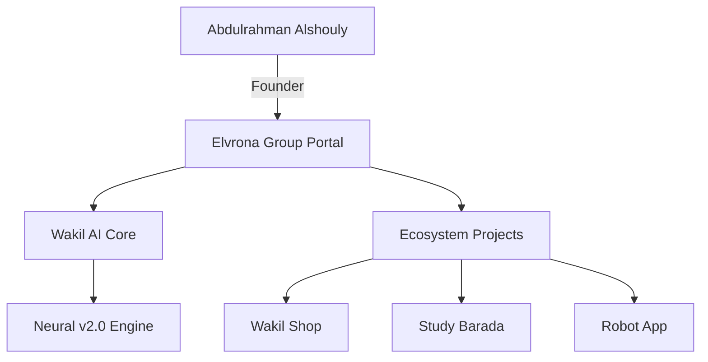

# 🌌 Elvrona Group & Wakil AI Ecosystem

Welcome to the official repository for the **Elvrona Group** ecosystem. This repository centralizes three core independent platforms, representing a unified vision of autonomous intelligence and professional digital presence.

---

## 🚀 The Three Pillars

| Platform | Domain | Description | Folder |
| :--- | :--- | :--- | :--- |
| **Elvrona Corporate** | `elvrona.cloud` | Strategic parent company and infrastructure portal. | `/elvrona-site` |
| **Abdulrahman Alshouly** | `3bod.dev` | Personal professional profile of the founder & CEO. | `/3bod-site` |
| **Wakil AI (Next.js)** | `wakil-rd.de` | Flagship autonomous AI chat application. | `/wakil-ai` |

---

## 🏢 1. Elvrona Group (Corporate)
**The Foundation of Future Intelligence.**
Elvrona is the strategic holding and innovation group overseeing the development of high-performance AI systems. 

- **Key Features:** ecosystem overview, core vision, and infrastructure transparency.
- **Tech Stack:** Vanilla HTML5, CSS3 (Premium Glassmorphism), AOS Animations.
- **Directory:** [`/elvrona-site`](./elvrona-site)

## 👤 2. Abdulrahman Alshouly (Founder Profile)
**The Architect Behind the Ecosystem.**
A high-fidelity professional landing page for the founder of Elvrona, showcasing his projects, skills, and strategic vision.

- **Key Features:** Integrated project cards, neural stats, and contact portal.
- **Tech Stack:** Premium Dark Mode, Lucide Icons, AOS Scroll Effects.
- **Directory:** [`/3bod-site`](./3bod-site)

## 🤖 3. Wakil AI (NextGen Application)
**Professional Autonomous AI.**
Our flagship chat terminal built on advanced LLM architecture with proprietary tuning and zero external API dependencies.

- **Key Features:** Neural logic execution, Visual Core Synthesis, and localized processing.
- **Tech Stack:** Next.js (App Router), TypeScript, Tailwind CSS, Framer Motion.
- **Directory:** [`/wakil-ai`](./wakil-ai)

---

## 🛠️ Architecture Overview

---

## 📦 Deployment Instructions

### GitHub Deployment
This repository is structured to support multi-site deployment via automated workflows or manual pushes:
1. Initialize git: `git init`
2. Add remote: `git remote add origin YOUR_REPO_URL`
3. Commit & Push: `git add . && git commit -m "Initial ecosystem launch" && git push origin main`

### Vercel Deployment
Each folder is a standalone project and can be deployed independently:
- **Profile Site:** `cd 3bod-site && vercel --prod`
- **Corporate Site:** `cd elvrona-site && vercel --prod`
- **Next.js App:** `cd wakil-ai && vercel --prod`

---

## 🎨 Global Design System
- **Accents:** Emerald Green (`#10b981`)
- **Theme:** Deep Space Dark (`#020617`)
- **Typography:** Inter (Standard) / Sora (Headings) / Monospace (Code)
- **Aesthetic:** Minimalist, High-Performance, Futuristic.

---

> **System Genesis · 0x4f2A · V2.5 — PRODUCTION READY**  
> &copy; 2026 Elvrona Group. All Rights Reserved.
